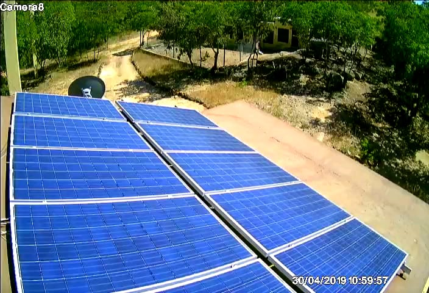

# ESP[8266-32] React Scheduler

I had a unique problem in my rural community and needed to find a better solution to. A prevous attempt using a rasberry pi running windows 10 Iot with a touchscreen was not very successful. This would work for a few days and the system would crash and sometimes dificult to start. I needed a new solution, but before I present the new solution let me describe the problem I was trying to address.

## Let's Automate This Home

Yes a drone took that picture!

## Original Windows IoT system

The one thing I miss is the image slide show for the 1000+ photos stored on the sd-card. Originl implementation was on .NET windows iot and the code base can be found [here](https://github.com/tichaonax/HwandazaWebService) for the web service. and [here](https://github.com/tichaonax/HwandazaHttpServer) for the Http Server on [github](https://github.com/).

Some video clips on this are on youtube [here](https://youtu.be/mtPby5VWATM)

## Solar Panels

These 10 solar panels each rated at 300 watts generate a total of 3000 watts, ie about 3KW on a full sun. In my area I do get very good sunshine from about 8:00 in the morning to about 4:00 in the afternoon. On the days of good sunshine you actually get a little more that that amount of energy. You cannot store all that hence you need to find ways to use the power realtime once the battery bank is full.

## Wind Generator

At night a wind turbine unreliably adds some energy to the battery bank whenever a gust of wind breezes by. 

## Battery Bank

Part of the solar energy is stored in the battery bank. Once the batteries are fully charged excess solar energy could go directly to appliances like cook tops and refridgerators without the need to use the battery bank. Power will go from solar panels to battery charge controllers straight to the inverters. So for example I do my clothes ironing around lunch time or as soon as the batteries are full. 

## Some Messy Wiring

Well without an electrical engineering degree you can only do so much but the wiring is safe. Electrical grounding and lightining protection was my number one.
##### Now that we got that out of the way lets get to business!

# Problem Statement.

At night time there is no more electricity coming from the solar panels and the wind turbine is unreliable. I rely on whatever has been stored in the batteries if they are still good. For small power usage the battery bank can handle the power needs. In order to have long life for the batteries we need to make sure that heavy appliances are not used after hours.

I need a network of systems that are each service a particular need. Conserving of electricity is primary. Power must be shared among all appliances and a way to do load shedding if necessary. In Summer the water table goes below safe level and sometimes dangerously low. The system must protect the water pump from running dry.

### Water Pump
	Water Pump can only run from 8:00AM to 4:00PM.
	Pump to run only run for 3-5 minutes every 15 to 30 minutes
	if the water tank is empty.
	
### Refrigerator

	The Fridge must run from 8:00AM to 6:00PM daily. 
	
### Lights

	1.	Bedroom lights to turn on at 7:00PM, turn off at 10:30PM
	2.	Living Room lights turn on 6:00AM, turn off: 10:00PM.

### Aditional requirements for lights

	1.	Bedroom lights: after 10:30 PM lights must randomly turn on/off for
	 	configurable duration until 4:30AM when they got off completely.
	 	
	2.	Living Room lights: after 10:00 PM lights must randomly turn on/off for
	 	configurable duration until 5:00AM when they got off completely.

### System reliability 

	It is important to safely operate the pump against the said 
	potential problems, the pump cannot run dry.
	
	Electricty is scarce and no water pumping or fridge opertion
	at night unless manual override by user.
	
	The control systems must be isolated from each other and be able to
	recover schedules as soon as possible is an event of a crash.
	
	The control systems must get their time from the internet but also
	allow for manual time setting in the event internet time is not available.
	
	Have a central place to manage these systems.
	

# Solution Space

Each system needed to control one device or a few at a minimum. I looked into the esp8266 micro-controller and it was the most promising. However there is some basic work that is needed to prepare configure the chip, wifi, file system, webserver interface etc before you can put your system on it.

I did not want to re-invent the wheel, so I researched and found that my best optipn to build on was work done by [*rjwats*](https://github.com/rjwats/esp8266-react).

### A basic scheduler for ESP8266 and ESP32 base on [*rjwats*](https://github.com/rjwats/esp8266-react).

## Advantages of rjwats framework high-level

	1.	ReactJS front end easy to customise UI
	2.	Wifi ready
	3.	Access Point
	3.	OTA and manual updates
	4.	MQTT enabled
	5.	Security features
	6.	Network Time
	7. Manual Time settings

You get all the above right out of the box, kudos to rjwats.	
On top of the above I added my stsyem functions with confugration via an easy to use UI. Please refer to section on what to watchfor for some of the problems that I encountered and how I addressed them.

## New Scheduling UI

	1. Status
	2. Automation

Make sure you are familiar with building the project by going to [*rjwats*](https://github.com/rjwats/esp8266-react) for more documentation. It might be helpful to just go through the exercide and build that project on its own before you clone my [*react scheduler*](https://github.com/tichaonax/esp8266-react-scheduler).

If you run into issues with the date-picker in REACT follow the steps on the link [*here*](https://material-ui-pickers.dev/getting-started/installation), a manual intervention will be needed in that case:

You may need to install the following modules after an attempt on the initial build.

	npm i @material-ui/pickers
	npm i @date-io/date-fns@1.x date-fns
	
I try to keep updating my master from rjwats to take advantage of new updates.

# ESP React Scheduler Screens

