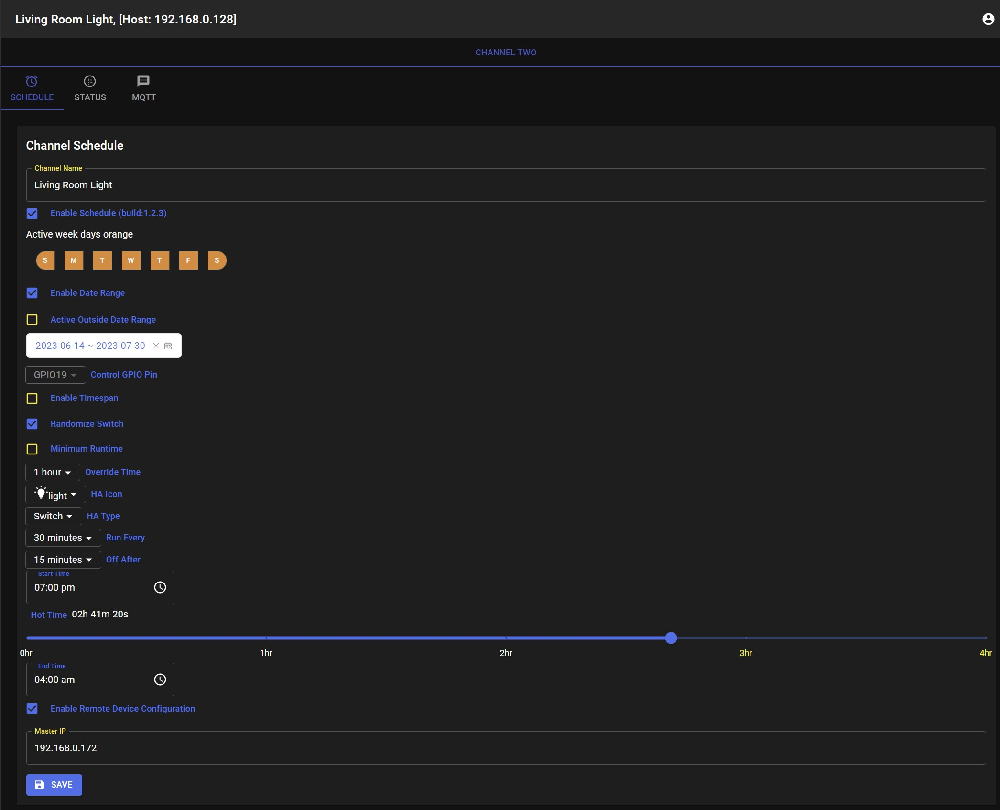
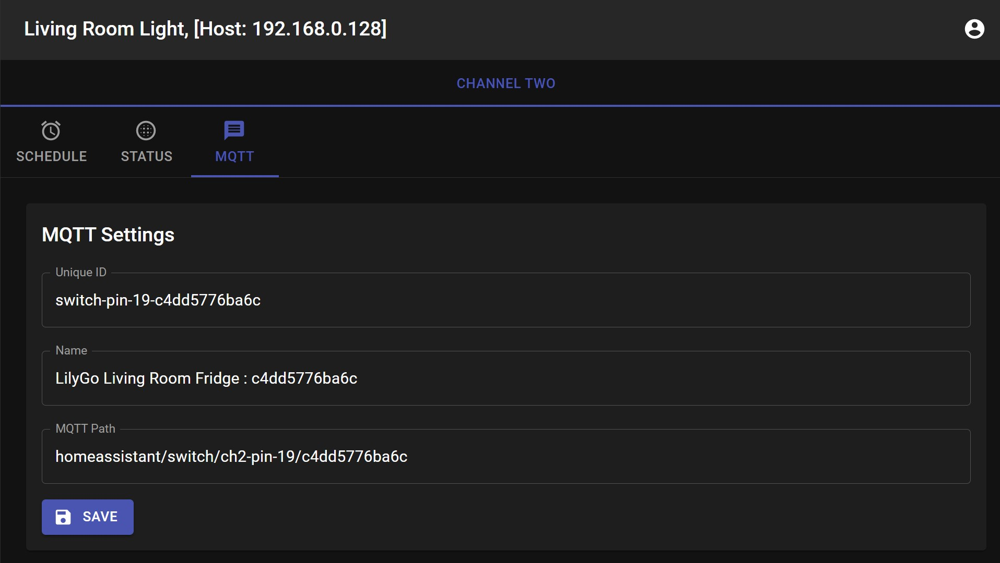
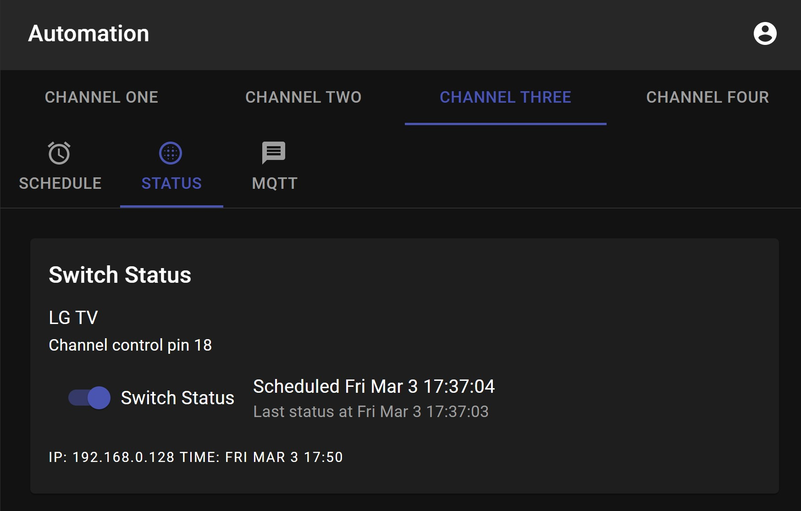
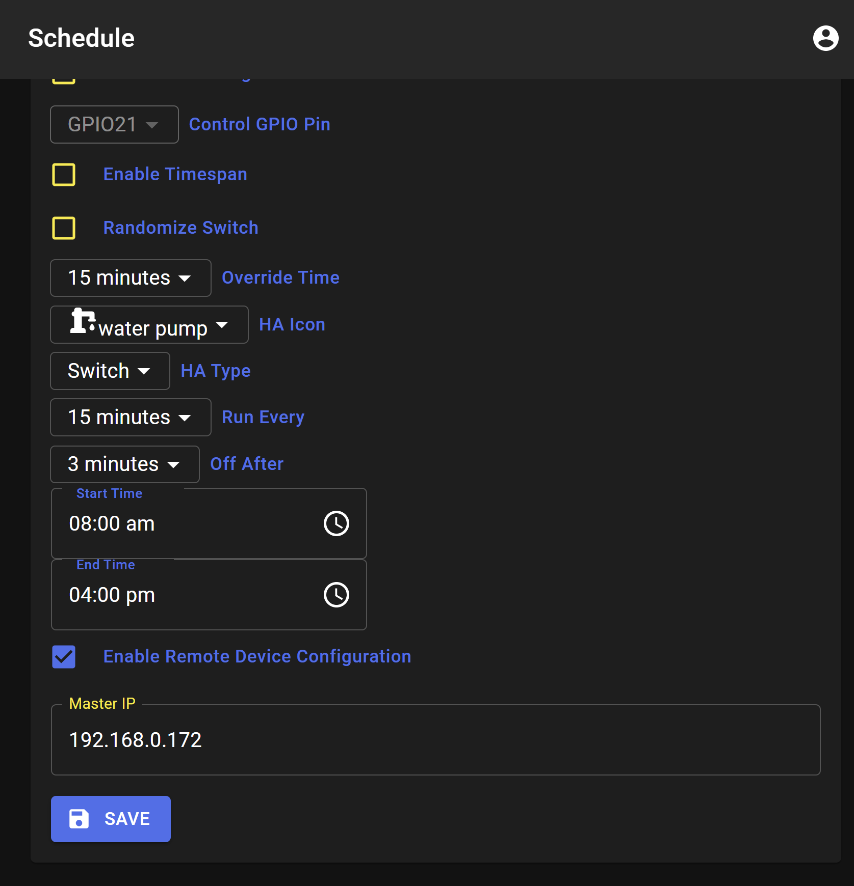

# ESP[8266-32] React Scheduler

I had a unique problem in my rural community and needed to find a sound solution to address it. A previous attempt using a raspberry pi running windows 10 Iot with a touchscreen was not very successful. This would work for a few days and the system would crash and sometimes difficult to start. I needed a new solution, but before I present the new solution let me describe the problem I was trying to address.

## Skip to
[Problem Statement](#problem-statement)

[Solution Space](#solution-space)

[Schedule Screens](#esp-react-scheduler-screens)

[Remote configuration](#remote-configuration)

[Homeassistant integration](#homeassistant-integration)

[Schedule](#scheduling-mobile) - settings

[MQTT](#mqtt)- setting up

[What to watch for](#what-to-watch-for) - potential problems to watch for, memory restriction etc.

[Boards](#boards-tested-with-the-project) - These boards have been tested to work.

[GPIO pins](#default-gpio-pins) - Default GPIO pins

[Low Memory devices](#low-memory-devices)

## Let's Automate This Home


Yes a drone took that picture!

## Original Windows IoT system


The one thing I miss is the image slide show for the 1000+ photos stored on the sd-card. Original implementation was on .NET windows iot and the code base can be found [*here*](https://github.com/tichaonax/HwandazaWebService) for the web service. and [*here*](https://github.com/tichaonax/HwandazaHttpServer) for the Http Server on [*github*](https://github.com/).

Some video clips on this are on YouTube [*here*](https://youtu.be/mtPby5VWATM)


## Solar Panels


These 10 solar panels each rated at 300 watts generate a total of 3000 watts, ie about 3KW on a full sun. In my area I do get very good sunshine from about 8:00 in the morning to about 4:00 in the afternoon. On the days of good sunshine you actually get a little more that that amount of energy. You cannot store all that hence you need to find ways to use the power realtime once the battery bank is full.

## Wind Generator


At night a wind turbine unreliably adds some energy to the battery bank whenever a gust of wind breezes by. 

## Battery Bank


Part of the solar energy is stored in the battery bank. Once the batteries are fully charged excess solar energy could go directly to appliances like cook tops and refrigerators without the need to use the battery bank. Power will go from solar panels to battery charge controllers straight to the inverters. So for example I do my clothes ironing around lunch time or as soon as the batteries are full. 

## Some Messy Wiring


Well without an electrical engineering degree you can only do so much but the wiring is safe. Electrical grounding and lightning protection was my number one.

##### Now that we got that out of the way lets get to business!

# Problem Statement

At night time there is no more electricity coming from the solar panels and the wind turbine is unreliable. I rely on whatever has been stored in the batteries if they are still good. For small power usage the battery bank can handle the power needs. In order to have long life for the batteries we need to make sure that heavy appliances are not used after hours.

I need a network of systems that are each service a particular need. Conserving of electricity is primary. Power must be shared among all appliances and a way to do load shedding if necessary. In Summer the water table goes below safe level and sometimes dangerously low. The system must protect the water pump from running dry.

### Water Pump
	Water Pump can only run from 8:00AM to 4:00PM.
	Pump to run only run for 3-5 minutes every 15 to 30 minutes if the water tank is empty.
	
### Refrigerator

	The Fridge must run from 8:00AM to 6:00PM daily. 
	
### Lights

	1.	Bedroom lights to turn on at 7:00PM, turn off at 10:30PM
	2.	Living Room lights turn on 6:00AM, turn off: 10:00PM.

### Additional requirements for lights

	1.	Bedroom lights: after 10:30 PM lights must randomly turn on/off for configurable duration until
		4:30AM when they go off completely.
	 	
	2.	Living Room lights: after 10:00 PM lights must randomly turn on/off for configurable duration 
		until 5:00AM when they go off completely.

### System reliability 

	It is important to safely operate the pump against the said potential problems, the pump cannot run dry.
	
	Electricity is scarce and no water pumping or fridge operation at night unless manual override by user.
	
	The control systems must be isolated from each other and be able to recover schedules as soon as possible
	is an event of a crash.
	
	The control systems must get their time from the internet but also allow for manual time setting in the
	event internet time is not available.
	
	Have a central place to manage these systems.
	

# Solution Space

Each system needed to control one device or a few at a minimum. I looked into the esp8266 micro-controller and it was the most promising. However there is some basic work that is needed to prepare configure the chip, wifi, file system, webserver interface etc before you can put your system on it.

I did not want to re-invent the wheel, so I researched and found that my best option to build on was work done by [*rjwats*] (https://github.com/rjwats/esp8266-react).

### A basic scheduler for ESP8266 and ESP32 based on [*rjwats*](https://github.com/rjwats/esp8266-react).

## Advantages of the [*rjwats*](https://github.com/rjwats/esp8266-react) framework high-level

	1.	ReactJS front end easy to customize UI
	2.	Wifi ready
	3.	Access Point
	3.	OTA and manual updates
	4.	MQTT enabled
	5.	Security features
	6.	Network Time
	7.	Manual Time settings

You get all the above right out of the box, kudos to rjwats.	
On top of the above I added my system functions with configuration via an easy to use UI.

## New Scheduling UI

	1. Status
	2. Automation

Make sure you are familiar with building the project by going to [*rjwats*](https://github.com/rjwats/esp8266-react) for more documentation. It might be helpful to just go through the exercise and build that project on its own before you clone my [*react scheduler*](https://github.com/tichaonax/esp8266-react-scheduler).

	
I try to keep updating my master branch from rjwats to take advantage of any new updates that may be useful.

# ESP React Scheduler Screens

### Channel Status Desktop
	


<br /> 

### Scheduling Mobile

 <style>
td, th {
   border: none!important;
}
</style>
<table>
  <tr>
    <td>Normal settings</td>
    <td>Timespan settings</td>
  </tr>
  <tr>
    <td valign="top"></td>
    <td valign="top"></td>
  </tr>
</table>

<br />

### MQTT

<table>
  <tr>
    <td>Randomize and Hot-time</td>
    <td>MQTT Settings</td>
  </tr>
  <tr>
    <td valign="top"></td>
    <td valign="top"></td>
  </tr>
</table>

<br /> 

### Status
	


<br />

### Remote configuration

<table>
  <tr>
    <td valign="top"></td>
  </tr>
</table>

You will notice that as you add new features to the project you quickly run out of memory. To get around that the complete UI is deployed to a device that has more memory like the ```ESP32```. This is then configured as the master device on the target device. The other device will only deploy the backend code which implements the apis but not the UI. This saves memory and cpu cycles on the smaller device. To remotely configure the chip you need to point to the master device, i.e the device that has the whole UI. The following URL will configure device on ip ```192.168.0.172``` from the UI on device ip ```192.168.0.190```. Adding the remote device ip makes it possible to directly manage the device from [homeassistant](#homeassistant-integration)

http://192.168.0.190/project/auto/channelOne#?device=192.168.0.172

With homeassistant integration the URL is created for you and you just need to click from the homeassistant screens under [attributes](#mobile-attributes).

This will allow you to do all the device configuration of the remote device from the device with more memory with the remote device doing the authentication if enabled.

### Automation information
```
This simple app allows user to control a switch through a simple schedule. It comes with default
settings that can be changed by user.
	
Channel Schedule is active only between the 'Start Time' and 'End Time' periods. Changes to the
schedule must be saved to take effect. The changes take effect after 5s from time changes are saved.
The schedule for the Channel is restarted with the new settings. The system also provides the device
time as well as the IPAddress of the device if connected to WIFI.
```
#### Channel control pin
```
This is the hardware pin on the micro-controller user may connect a relay in order to control a device.
Solid State Relays (SSR) may be connected directly to the pin without the need for buffering transistors.
```
#### Schedule
```
Is a set of user selected options that determine the periods during which the connected device may be 
controlled automatically.
```
#### Enable schedule?
```
When checked the schedule is active.
```
#### Enable TimeSpan?
```
When checked disabled 'Randomize', the switch is activated only during the time period from 'Start Time'
to 'End Time'.
```
#### Randomize Switch?
```
When checked enables 'Hot Time' feature, the switch is on/off randomly within the 'Run Every' and 'Off After'
limits. Disabled when 'TimeSpan' is active.
```
#### Minimum RunTime?
```
When checked enables minimum runtime is at least 'Off After' value enabled when randomize is active
```
#### Channel Name
```
User defined channel name that shows on the screen, if one is not provided system defaults to factory
settings value.
```
#### Run Every
```
Turns on the switch repeatedly at the selected time frequency. If 'Enable TimeSpan' is checked the option
is disabled and is ignored. If 'Randomize' option is enabled the switch can turn on after a random delay
up to 'Run Every' minus 'Off After' duration. This is useful to simulate person turning lights on/off at
night in bedrooms.
```
#### Off After
```
Turns off the switch at the end of this time period automatically after switch is activated by the
'Run Every' event. If 'Enable TimeSpan' is checked the option is disabled and is ignored.
If 'Randomize' option is enabled the switch can turn off after a random delay up to 'Off After' duration.
```
#### Start Time
```
The start time when the schedule is active. If the start time is greater than the end time then
schedule ends the following day.
```
#### Hot Time
```
The duration that the switch is on before randomize feature takes over.
```
#### End Time
```
The end time when the schedule is active.
```
# Homeassistant integration

Homeassistant integration comes for free, check out resource for Homeassistant [*here*](https://www.home-assistant.io/)

### Desktop


### Mobile
	


<br/>

### Mobile attributes


When properly integrated homeassistant will show the schedule attributes from homeassistant which the device registers with the ```MQTT``` auto-discovery feature of homeassistant without any custom configuration on homeassistant. This out of the box integration feature with homeassistant makes it possible to just add new devices and managing them from homeassistant. The IP address of the devices is sent to homeassistant as part of config payload data.  

## What To Watch For

	Like every project, it comes with challenges and lots of frustration. But they say no pain no gain,
	besides solving a hard problem brings a lot of satisfaction in the end. Below are some of gotchas
	to watch for.
	
	The most important thing is to get your environ properly setup for esp, VSCode makes it easier to work
	on the project and there are tons of articles to get you up to speed.
	
	Do not have a long running process in your loop, the system watch-dog will yank the carpet underneath
	your code without notice and will be very hard to debug. If you see your chip resetting often that may
	be the case.
	
	If successfully deployed to the microcontroller the onboard led will blink fast while looking for an access point and then when it gets
	wifi connection it will blink slow. If you see the led flash again after it has gotten wifi it indicates
	the system crashed and restarted.

#### Selecting the chip
	
	The project has four independent channels that can turn on a switch per the schedule defined. However only
	the ESP32 can load all the four channels on the chip and work well. ESP8266 can only handle one channel
	especially if you want to be able to override the system defaults by using the React UI.

	The Esp-01 cannot deploy the UI.
	
### Choosing which channels to load on chip

##### platform.ini

	You can choose which channels to install by uncommenting the corresponding CHANNEL in the platform.ini file.   
	


##### .env

	You also need to match the UI screens to load by setting the CHANNEL in the .ev file. When set to false the corresponding UI channel will be disabled but to save memory you also need to disable the matching channel on the backend.
	


## Boards tested with the project

### esp32 board

This board supports all the four channels. You can use this as the master device for to contain the UI to configure the devices with less resources.

```esp32```


<br/>

### esp32 lilygo relay board

This board supports all the four channels and comes with four onboard relays. 

```esp 32 lilygo relay board```


<br/>

### esp8266 board

```esp8266```


<br/>
### sinilink  board

This board supports one channel with an onboard relay. You can do OTA but need to disable ```PROGMEM_WWW``` and similar steps for ```esp-01``` described below.

```esp8266 sinilink```


<br/>

### esp-01 board

You will need to make sure you select right device in ```platform.ini```, disable ```PROGMEM_WWW```
and do not upload the react image, this device can only support one scheduler channel and will not support OTA as there is limited  memory on the device. This is a cheap device that is abundant and good enough for controlling as simple switch.

```esp-01```


## Default GPIO pins

The UI supports changing IO pin used for turing on the relay. This is important for different devices have different pins for IO.

### ```esp32```

channel one ```GPIO 21```

channel two ```GPIO 19```

channel three ```GPIO 18```

channel four ```GPIO 5```

## ```esp8266```

channel one ```GPIO 5```

channel two ```GPIO 12```

channel three ```GPIO 13```

channel four ```GPIO 14```

## ```sinilink device```

channel two ```GPIO 12```

## ```esp-01```

channel one ```GPIO 0```


## Low Memory devices
The system will not fit in low memory devices so you need to disable certain features, please refer to [*rjwats*] (https://github.com/rjwats/esp8266-react) for details.

In the ```platform.ini``` turn off

 ; Uncomment PROGMEM_WWW to enable the storage of the WWW data in PROGMEM <br/>
 ```;-D PROGMEM_WWW```

Only ESP32 with at least 4MB will support all the four scheduler channels including PROGMEM_WWW support.

All others devices will less memory you can only support one channel and have to disable PROGMEM_WWW
